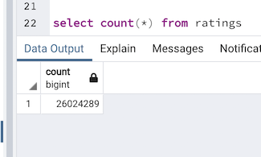

# Movies-ETL

## Project Overview

Amazing Prime is a company that wants to host a Hackaton where the participants will try to predict which movies will become popular. To achieve this, data about movies needs to be collected and cleaned, which will be done by utilizaing the ETL(Extract, Transform and Load) process.

### Solution Design

The project solution will involve ETL process to create an automated pipeline that gathers movie data from different sources such as CSV and JSON files, performs the appropriate transformation such as reading data into Pandas DataFrames, removing null values and dropping nonrelevant information, and finally loading data into its final destination with Python's Pandas library and applying to_sql paired with sqlAlchemy method.

## Extract

The first step of ETL process is extraction. Using a Wikipedia JSON file that was provided by Amazing Prime, which contains information about movies, budgets, box office returns, among others. 
In addition to Wikipedia's JSON file, more data was extracted from kaggle.com, which is a source that it pulls its dataset from the MoviesLens dataset, which has more than 20 million reviews and contains details about the movies on a metadata file.
After downloading the data from kaggle, only the files movies_metadata.csv and ratings.csv were kept since those are the ones to contain the data needed for this project.

### Wikipedia Movies

- Extracting the data from wikipedia-movies.json and reading it into a Pandas DataFrame called wiki_movies_raw_df, the data starts with 193 columns.

### Kaggle Metadata 

- Inspecting the movies_metadata.csv extracted from kaggle.

### Kaggle Ratings

- Inspecting the ratings.csv extracted from kaggle.

## Transform

- Data was inspected several times throughout the process.
- List comprehensions were used to filter out TV shows
- Alternative titles were handled by combining them into one list, inside a function called clean_movie
- Columns with the same data information were merged
- After counting the number of columns that had null values, it was seen that almost all columns had at least a few null values, so it was decided to keep columns that had less than 90% of null values.
- After that the values were parsed and cleaned by applying Regular expressions(regex).
- At this point there were two data_frames with information about movies, which had to be unified into one. 
- After analyzing both DataFrames, wiki_movies_df and kaggle_metadata, it was decided that the kaggle_metadata would be kept since its data was more consistent with less null values and the DataFrames would be merged on a way the empty values on the kaggle_metadata would be filled with data from wiki_movies_df.
- Using the ratings.csv file, the DataFrame ratings_df was created by using the Python's groupby function on the columns "movie_Id" and "ratings". 
- Lastly, ratings_df was merged with movies_df creating a new one called movies_with_ratings_df.

### Wikipedia Movies DataFrame 

- After transforming wiki_movies_raw_df, the clean data is now only 21 columns and has the name of wiki_movies_df.

### Movies DataFrame

- The following image shows movies_df, which is the result of merging wiki_movies_df and kaggle_metadata.

### Movies with Ratings DataFrame

- The image bellow represents the DataFrame movies_with_ratings_df which represents the merge of movies_df and rating_counts.

## Load

The final step of the ETL process is to load movies_df and movies_with_ratings_df into data into its final destination with Python using its Pandas library and applying to_sql paired with sqlAlchemy method.

- The image bellow shows the data being loaded from ETL_create_database.ipynb file into the PgAdmin, PostgreSQL 11 server.

### Checking the Data on pgAdmin

- After loading the DataFrames into PgAdmin it is possible to see that two tables were created on the , ratings and movies.

#### Ratings Query

-   The image presented bellow shows the count of rows on the ratings table.

- The image presented bellow shows the count of rows on the movies table.

#### Movies Query

## Note

The ratings.csv file was too large to push into github. 